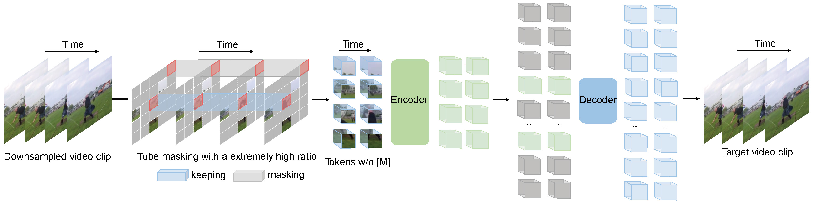

# Video Classification lab

Классификация видео с помощью предобученных нейронных сетей.

## Содержание
- [Описание данных](#описание-данных)
- [Модель](#модель)
- [Результаты](#результаты)
- [Детали тренировки](#детали-тренировки)
- [Структура проекта](#структура-проекта)
- [Лицензия](#лицензия)

## Описание данных

В качестве набора данных использовался датасет [COIN](https://coin-dataset.github.io). Проводилась классификация на 12 классов:
```
1. Dish
2. DrinkandSnack
3. ElectricalAppliance
4. FurnitureandDecoration
5. Gadgets
6. Housework
7. LeisureandPerformance
8. NursingandCare
9. PetsandFruit
10. ScienceandCraft
11. Sport
12. Vehicle
```

В качестве фильтрации были выделены видео продолжительностью от 10 до 60 секунд из-за ограничений по памяти.

В результате тренировочный набор включал 787 видео, тестовый 253 (24.33%) преобразовываемых к размеру 112x112 пикселей.

На изображенях приведены распределения классов и длина видео.


## Модель
Использовался [VideoMAE](https://huggingface.co/docs/transformers/main/en/model_doc/videomae), предобученный на Kinects, Something-Something V2, UCF101, HMDB51.


Оригинал: [статья](https://arxiv.org/abs/2203.12602)

**Описание архитектуры и преимущества:**

VideoMAE (Video Masked Autoencoders) - это модель для классификации видео, разработанная с использованием концепции Masked Autoencoding, адаптированной для видеоданных. Основные особенности:

- Эффективность Обучения: VideoMAE использует маскирование большого объема входных данных (до 90% видеокадров), что значительно сокращает требования к вычислительным ресурсам, ускоряя процесс обучения без ущерба для точности.

- Обработка Временной Динамики: Модель эффективно обрабатывает временные зависимости в видео за счет использования Transformer-архитектуры, что позволяет улавливать динамику и контекст видеофрагментов.

- Преимущество Предобучения: Благодаря предобучению на разнообразных наборах данных (Kinetics, Something-Something V2, UCF101, HMDB51), VideoMAE обладает обширным пониманием различных типов видео-контента, что обеспечивает высокую обобщающую способность.

## Результаты
Оценка результатам производилась для двух вариантов обучения:
- без MixUp
- c MixUp ($\alpha$=0.4)

### Сравнительная таблица

|   Type   |    Training Loss |            Test Loss |        Precision |           Recall     | F1-Score | 
|---------:|-----------------:|---------------------:|-----------------:|---------------------:|---------:|
| No MixUp   |           1.121 |        **0.522** |           **0.522**  |               **0.522** |**0.522**     |
| With MixUp |           1.471 |               1.815 |           0.411 |                0.411 |  0.411      |

### Вывод

Результаты без использования аугментации смешивания видеофреймов показывают лучший результат. Возможно, $\alpha$=0.4, добавляет сильную дисперсию, учитывая малый объем тринеровочных данных, результат закономерен.

## Детали тренировки
- Epochs = 15
- Batch size = 32
- AdamW optimizer
    - Learning rate = 5e-0.5
    - Wight decay = 0.05
    - LR_scheduler_type="cosine"
- Wandb logging

## Структура проекта
```
├── data
│ ├── videos
│ └─── train
│   │ ├── Dish
│   │ └── ...
│   └── val
│     ├── Dish
│     └── ...
│
├── notebooks
├── reports
│ └── figures
└── src
```

## Лицензия
MIT License